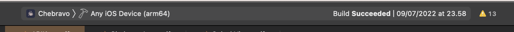
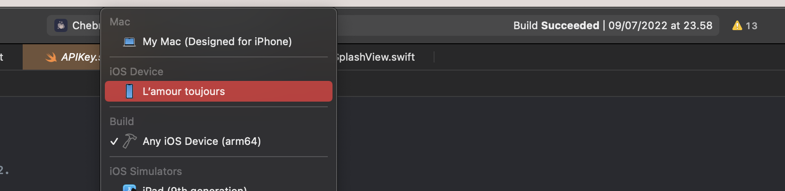

# CheBravo
#### Learning Italian Your Way

### Features
* Add your own words and practice them over time
* Added words gets intantly translated
* COMING see examples of selected word
* COMING Conjugate words real time
* COMING Practice mode

#### Introduction
We all learn in different ways, therefore CheBravo enables you to manage your own learning pace and difficulty. You will be able to translate words on the fly and save them for later to retain words more effectively.


## Installation
Two prerequisites:
- Have XCode downloaded
- Have an API key from [DeepL](https://www.deepl.com/pro-api?cta=header-pro-api/) 


#### Installation of XCode
1. Head to the App Store on the Mac
2. Search for "XCode" in the search field
3. Wait for the install (Can take up to two hours :/ )


#### Getting an API key from DeepL
1. Head to the link [DeepL](https://www.deepl.com/pro-api?cta=header-pro-api/) 
2. Sign up for free and select the free plan
3. Paste in your E-mail and Credit Card credentials (In order to have a free plan if you surpass 500.000 character per month)
4. When account is made - head to you account under the Account tap
5. Scroll down until you find the "Authentication Key for DeepL API

#### Setup
1. Download this repository
2. Head to the CheBravo folder
3. Make a file called "APIKey.swift" and paste the contents below into the file 
```swift
import Foundation

struct APIKey {
    var DeepLTranslatorAPIKey = "<YOUR API KEY>"
}

```
4. Head to the root folder of the project and open "Chebravo.xcodeproj"
5. Connect you IPhone to your computer so XCode can talk with your Phone
6. In the top of XCode select your own device
<div>
 <br />
 <br />
</div>
7. When you are installing the app, you have to give your phone permission -> Settings/General/VPN & Device Management <br />
8. Under the VPN & Device Management press on "Apple Development: xxx@email.com" <br />
9. Approve apps <br />
10. Rerun the application in Xcode <br />
Enjoy


## Process

### Initial designs
<div>


</div>


### Updates
Jul 6 : \


CheBravo uses API from [DeepL](https://www.deepl.com/translator) in order to effectively translate words.
Developed by Phillip Lundin
