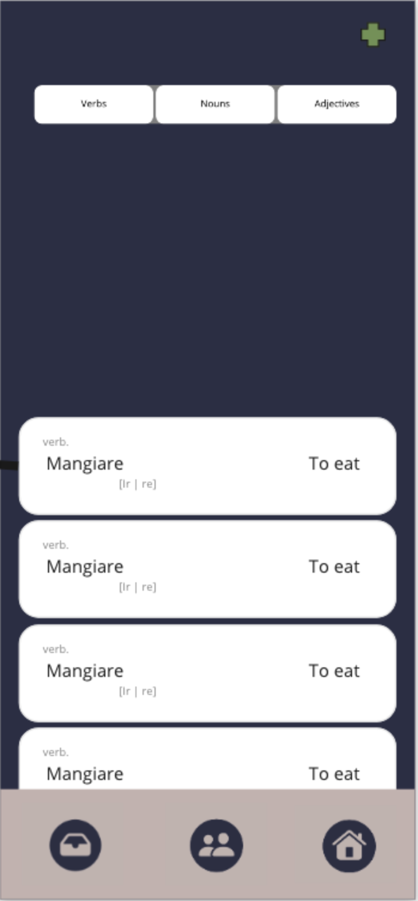
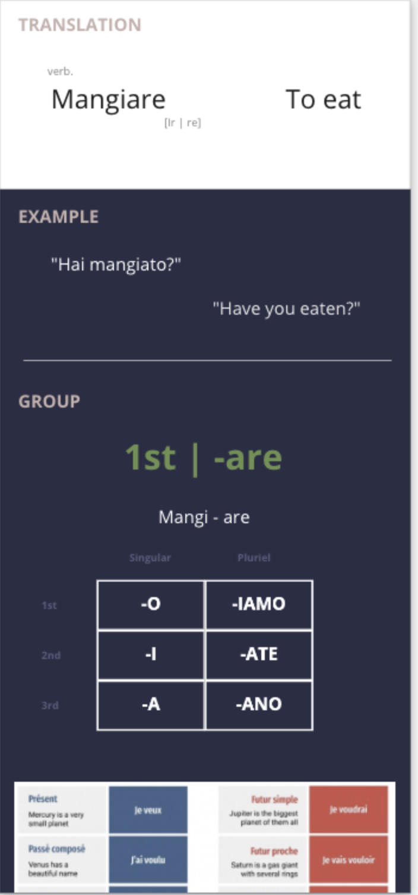

# CheBravo
#### Learning Italian Your Way

### Features
* Add your own words and practice them over time
* Added words gets intantly translated
* Added 8 modules for basic Italian
	- Numbers, Definite articles, Pronunciation, Asking Questions, Common Verbs & Conjugatoions, Possessive Adjectives, Time concepts, Directions.
* Added examples with translation 

Next Iteration
* COMING Conjugate words real time
* COMING Practice mode
* COMING See examples of selected word

#### Introduction
We all learn in different ways, therefore CheBravo enables you to manage your own learning pace and difficulty. You will be able to translate words on the fly and save them for later to retain words more effectively.

## Installation
Link coming soon to appstore

### Initial designs

### Updates
Jul 6 : \

Aug 31 : \

CheBravo uses API from [DeepL](https://www.deepl.com/translator) in order to effectively translate words.
Developed by Phillip Lundin
